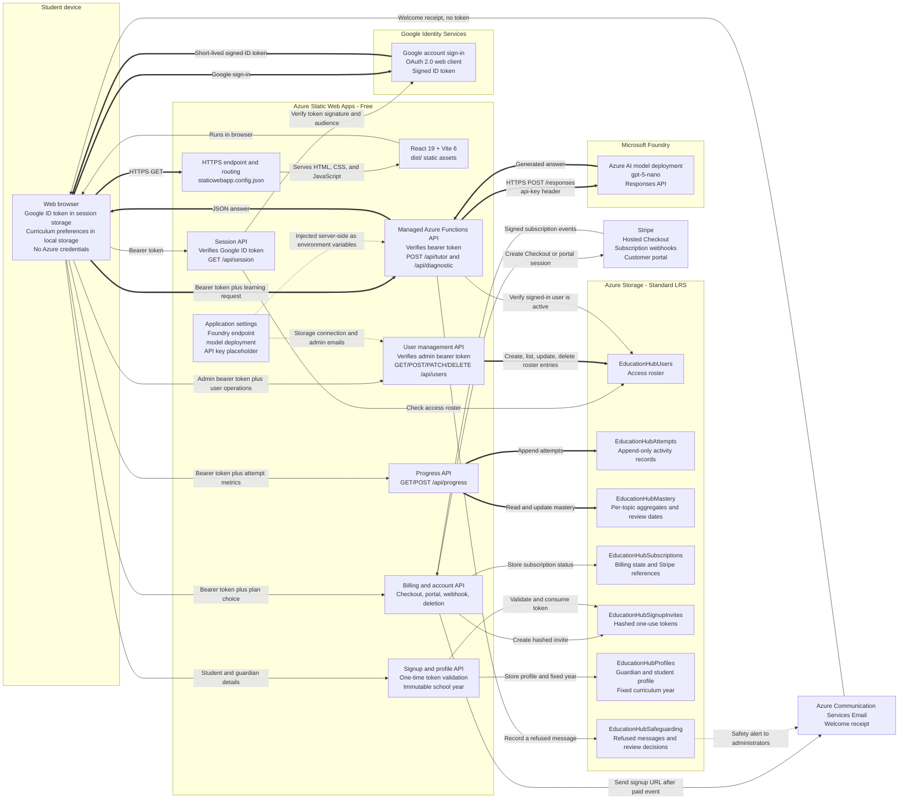
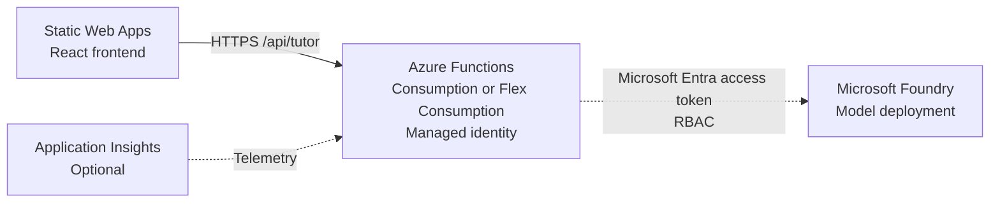

# Education Hub Azure Architecture

**Status**: Target architecture; Azure resources are not provisioned yet  
**Primary region**: Choose one UK region that supports the selected model  
**Runtime resources**: 4 Azure services plus Stripe billing  
**Updated**: 9 September 2026

## Overview

Education Hub uses a low-cost serverless architecture for KS3, KS4, and GCSE learning. Azure Static Web Apps serves the React application and its managed Node.js Azure Functions API. The API is the trust boundary: browsers send curriculum context and a student's question to it, and only the API communicates with the Azure AI Foundry model deployment.

Authentication uses Google Identity Services while retaining the Static Web Apps Free plan. Google issues a short-lived ID token to the browser after sign-in. The browser sends that token as a bearer credential to the API, where Google's supported server library verifies its signature, issuer, expiry, verified-email flag, and OAuth client audience before the application trusts the identity.

The initial deployment uses the Static Web Apps Free plan, a consumption-priced `gpt-5-nano` deployment, Standard LRS Table Storage, and Azure Communication Services Email for post-payment signup delivery. No relational database, virtual network, API Management instance, or separate Function App is required.

## Resource Inventory

| Logical name | Azure resource | Tier/SKU | Purpose |
| --- | --- | --- | --- |
| `education-hub` | Azure Static Web Apps | Free | Hosts the Vite/React build, HTTPS endpoint, routing, and managed Functions API |
| `education-hub-model` | Microsoft Foundry model deployment | Consumption, `gpt-5-nano` | Generates explanations, practice questions, worked examples, and feedback |
| `educationhubdata` | Azure Storage account | Standard LRS, Table Storage | Stores access, subscriptions, learning attempts, mastery aggregates, and safeguarding flags |
| `education-hub-email` | Azure Communication Services Email | Consumption | Sends welcome receipts after confirmed payment, and password resets |
| `education-hub-billing` | Stripe Checkout, webhooks, and customer portal | Transaction priced | Collects payment details and manages recurring subscriptions outside Azure |

Static Web Apps may create or use platform-managed supporting resources internally. They are not separate application components managed by this repository.

## Architecture Diagram

## Request Flow

1. A student loads the site over HTTPS. Static Web Apps serves the compiled React assets from `dist/`.
2. The student signs in with Google. Google returns a signed ID token to the frontend, which keeps it in session storage rather than persistent local storage.
3. The frontend sends the token to `/api/session` in the `Authorization: Bearer` header.
4. The Function verifies the token with Google's library and checks that the Gmail address is an administrator or has an active row in the access table.
5. An approved non-admin account without an active subscription is shown the single GBP 9.99 monthly plan and redirected to Stripe Checkout. Payment is taken immediately; there is no trial.
6. Stripe sends a signed webhook. Only a completed checkout with `payment_status=paid` creates onboarding access.
7. Azure Communication Services emails a welcome receipt. It carries no token and no deadline, because learner setup happens in the app and nothing about getting started depends on the email arriving.
8. Learner setup opens in the app as soon as the subscription is active. The parent or guardian enters their contact details and the student's name, date of birth, school, curriculum year, and GCSE options, and `POST /api/onboarding` stores the profile against the signed-in account. Stripe returns the customer before its webhook necessarily has, so the app waits and re-checks rather than showing the paywall to someone who has just paid.
9. The selected Year 7-11 value becomes immutable. Tutor, diagnostic, and progress APIs load it from the server profile instead of trusting a year supplied by the browser.
10. The app presents a short curriculum diagnostic and sends all completed answers to `POST /api/diagnostic` in one authenticated request.
11. The Function verifies access, asks Azure AI Foundry to score each answer against its stated outcome, and returns bounded topic-level evidence.
12. The browser stores the evidence locally and orders priority topics before developing, unassessed, and strength topics.
13. The frontend posts the selected context, question, and up to six recent chat messages to `/api/tutor`, including the same bearer token.
14. The Function verifies access again, builds an age-appropriate UK education prompt, and reads its Foundry configuration from server-side application settings.
15. The Function calls the model's `/responses` endpoint and returns only the generated answer to the browser.
16. Completing any learning activity posts accuracy, confidence, elapsed time, mode, and topic to `/api/progress`; the API appends an attempt and updates that topic's mastery and next-review date.
17. Student and parent dashboards read the signed-in account's aggregate progress without exposing storage credentials.

## Credentials and Tokens

The browser never receives the Foundry API key, an Azure access token, the Google client secret, or server application settings. It does receive a Google ID token after sign-in; this token is stored for the browser session and sent only over HTTPS to the same-origin API. The backend validates it on every protected request.

This sign-in flow uses only a public Google OAuth client ID and does not require a Google client secret. The cheapest Foundry path stores `AZURE_AI_API_KEY` as an encrypted Static Web Apps application setting and sends it only from the Function to Foundry in the `api-key` request header.

The API also supports `DefaultAzureCredential`. If `AZURE_AI_API_KEY` is absent, the Function requests a short-lived bearer token for `https://ai.azure.com/.default`. This is intended for local Azure CLI/developer credentials or a future separately hosted Function App with managed identity and the required Foundry RBAC role. Do not assume managed identity is available to the managed Function in the Free Static Web Apps design.

| Setting | Stored in | Exposure |
| --- | --- | --- |
| `AZURE_AI_FOUNDRY_ENDPOINT` | Static Web Apps application settings | Server-side API only |
| `AZURE_AI_MODEL_DEPLOYMENT` | Static Web Apps application settings | Server-side API only |
| `AZURE_AI_API_KEY` | Static Web Apps application settings | Secret; server-side API only |
| `AZURE_AI_TOKEN_SCOPE` | Static Web Apps application settings | Non-secret configuration |
| `VITE_GOOGLE_CLIENT_ID` | Frontend build environment | Public OAuth client identifier |
| `GOOGLE_CLIENT_ID` | Static Web Apps application settings | Server-side expected token audience; not a secret |
| `ADMIN_EMAILS` | Static Web Apps application settings | Server-side bootstrap administrator list |
| `AZURE_STORAGE_CONNECTION_STRING` | Static Web Apps application settings | Secret; user API and tutor API only |
| `AZURE_STORAGE_USERS_TABLE` | Static Web Apps application settings | Non-secret table name |
| `AZURE_STORAGE_ATTEMPTS_TABLE` | Static Web Apps application settings | Non-secret table name |
| `AZURE_STORAGE_MASTERY_TABLE` | Static Web Apps application settings | Non-secret table name |
| `AZURE_STORAGE_SUBSCRIPTIONS_TABLE` | Static Web Apps application settings | Non-secret table name |
| `AZURE_STORAGE_SIGNUP_INVITES_TABLE` | Static Web Apps application settings | Non-secret table name |
| `AZURE_STORAGE_PROFILES_TABLE` | Static Web Apps application settings | Non-secret table name |
| `STRIPE_SECRET_KEY` | Static Web Apps application settings | Secret; server-side billing API only |
| `STRIPE_WEBHOOK_SECRET` | Static Web Apps application settings | Secret; validates Stripe event signatures |
| `STRIPE_PRICE_MONTHLY` | Static Web Apps application settings | Server-side Stripe price identifier for the single GBP 9.99 monthly plan |
| `APP_BASE_URL` | Static Web Apps application settings | Public site URL used for billing redirects |
| `AZURE_COMMUNICATION_EMAIL_CONNECTION_STRING` | Static Web Apps application settings | Secret; email service credential |
| `AZURE_COMMUNICATION_EMAIL_SENDER` | Static Web Apps application settings | Verified sender address |

Student prompts and recent conversation text are sent to the backend and then to the configured model. The current app does not persist them in a database, with one deliberate exception: a message the tutor guard refuses is stored in `EducationHubSafeguarding` so an administrator can review it.

Payment-card data is entered on Stripe-hosted pages and is not sent to the React app or Azure Functions. Education Hub stores Stripe references and subscription state so it can enforce access. Account deletion immediately requests subscription cancellation, removes the roster and learning records, and clears browser-local learner data after the API succeeds. Stripe may retain transaction records where required by law.

The guardian and learner profile is stored in `EducationHubProfiles`. The learner's name, date of birth, school, and guardian contact details are not included in model requests. The server reads the immutable Year 7-11 value from the profile so it can constrain explanations and reject cross-year progress writes.

## Progress Data Model

All progress tables use a SHA-256 hash of the normalised signed-in email as the partition key. Raw email addresses are not stored in attempt or mastery entities.

| Table | Row key | Important properties | Write pattern |
| --- | --- | --- | --- |
| `EducationHubAttempts` | Timestamp plus random UUID | Year, subject, topic, mode, accuracy, confidence, duration, marks, completion time | Append one immutable entity per completed activity |
| `EducationHubMastery` | Hash of year, subject, and topic ID | Attempt count, average accuracy, average confidence, total time, mastery score, last practised, next review | Replace one aggregate entity after each attempt |
| `EducationHubSafeguarding` | Descending timestamp plus random UUID | Learner email and name, severity, guard reason, the refused message, alert delivery, review status, reviewer and note | Append one entity per refused message; merge a review decision onto it |

`EducationHubSafeguarding` shares the hashed partition key but deliberately breaks the rule above: it stores the learner's address and the refused message in the row, because a safeguarding record that cannot name the child or show what was said cannot be acted on. Row keys count down from a fixed maximum so a learner's newest flags read back first. See [the tutor guardrails](tutor-guardrails.md) for the severity routing and the alert path.

Mastery weights the newest attempt at 35% so improvement is reflected without erasing earlier evidence. Review intervals increase after accurate, confident recall and return to one day after weak recall. The progress API returns at most 100 recent attempts plus all mastery aggregates for the selected year.

The student and parent curriculum tracker joins those mastery aggregates to the complete bundled curriculum for the learner's immutable year. A topic is `Completed` at 80% mastery or above, `Review due` when its review date has passed, `In progress` when it has evidence but is below the completion threshold, and `Not started` when no mastery record exists. This lets the interface report both studied work and the full remaining curriculum without creating extra storage records for untouched topics.

## Security Boundary

- `/api/session`, `/api/tutor`, `/api/diagnostic`, `/api/progress`, `/api/safeguarding`, and `/api/users` verify the Google bearer token inside the Function. Invalid, expired, unverified-email, or wrong-audience tokens are rejected.
- Tutor, diagnostic, and progress APIs require an active roster user, active paid subscription, completed signup, and stored learner profile. Administrators are exempt for service operation.
- Learner setup is authenticated rather than token-based: `POST /api/onboarding` identifies the account from the signed-in principal and refuses an account without an active subscription. The older emailed links contained 256-bit random tokens stored only as SHA-256 hashes; no new links are issued, and any already sent expire after 48 hours.
- The user management, content review, and safeguarding APIs require a verified Gmail address configured in `ADMIN_EMAILS`. Safeguarding is administrator-only rather than parent-level, because a flag may concern the household a parent account belongs to.
- Static Web Apps provides HTTPS and same-origin routing, but the current code does not implement per-user quotas or application-level rate limiting.
- The server limits forwarded chat history to six messages, but it does not yet enforce request-size or token budgets.
- Secrets belong in Azure application settings or local ignored configuration, never in React source, Git, or browser storage.

## Upgrade Path

Keep the two-resource design for a prototype or low-traffic learning site. When identity, abuse protection, or production controls become necessary, move the API to a separate Azure Functions Consumption/Flex Consumption app, enable system-assigned managed identity, grant the minimum Foundry inference role, and remove the API key. Add monitoring and a usage budget before adding databases, private networking, or API Management.

## Deployment Dependencies

1. Create or select a Foundry resource and deploy `gpt-5-nano` in a supported region.
2. Create a Standard LRS Storage account and obtain a Table Storage connection string.
3. Create the Static Web App with app location `/`, API location `api`, and output location `dist`.
4. Create a Google OAuth 2.0 Web client and authorise the local and deployed JavaScript origins.
5. Provide `VITE_GOOGLE_CLIENT_ID` to the frontend build and configure the matching `GOOGLE_CLIENT_ID`, Foundry settings, Storage settings, and at least one `ADMIN_EMAILS` address in Static Web Apps application settings.
6. Create a single Stripe monthly recurring price of GBP 9.99, configure the customer portal, add the Stripe server settings, and register the billing webhook URL.
7. Create Azure Communication Services and an Email Communication Services domain, connect them, verify the sender, and add the email settings.
8. Deploy the repository, sign in with the bootstrap administrator Gmail address, and add the first application users from the dashboard.
9. Complete a Stripe test-mode payment, confirm receipt of the signup email, submit the profile, and verify that the selected year is locked.
10. Test `POST /api/tutor` through the Static Web Apps URL as an active subscribed user.

## Cost Notes

- Static Web Apps Free is the preferred starting tier for this project.
- The managed API avoids paying for a separate always-on web server.
- Foundry model inference is the main variable cost, so keep prompts concise and cap response length as usage grows.
- Table Storage holds the access roster plus compact attempt and mastery entities. Curriculum content remains bundled with the frontend, and chats are not persisted apart from messages the tutor guard refused.
- Azure Communication Services Email is used only for transactional signup delivery after successful payment.
